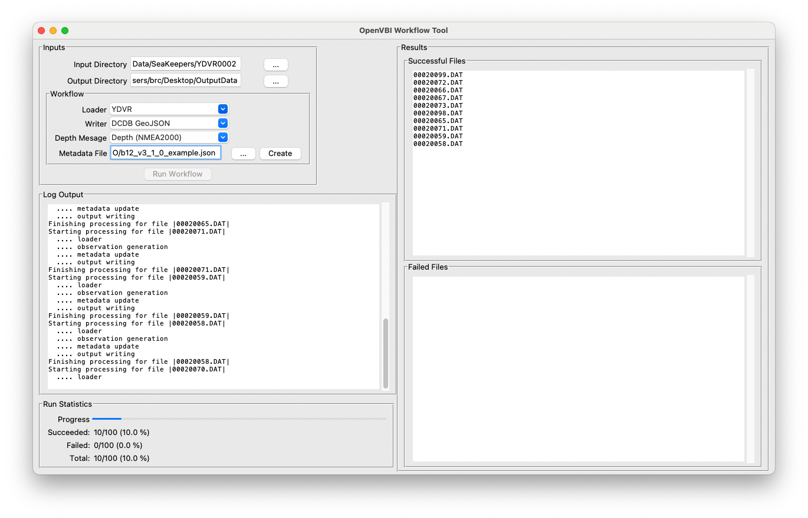
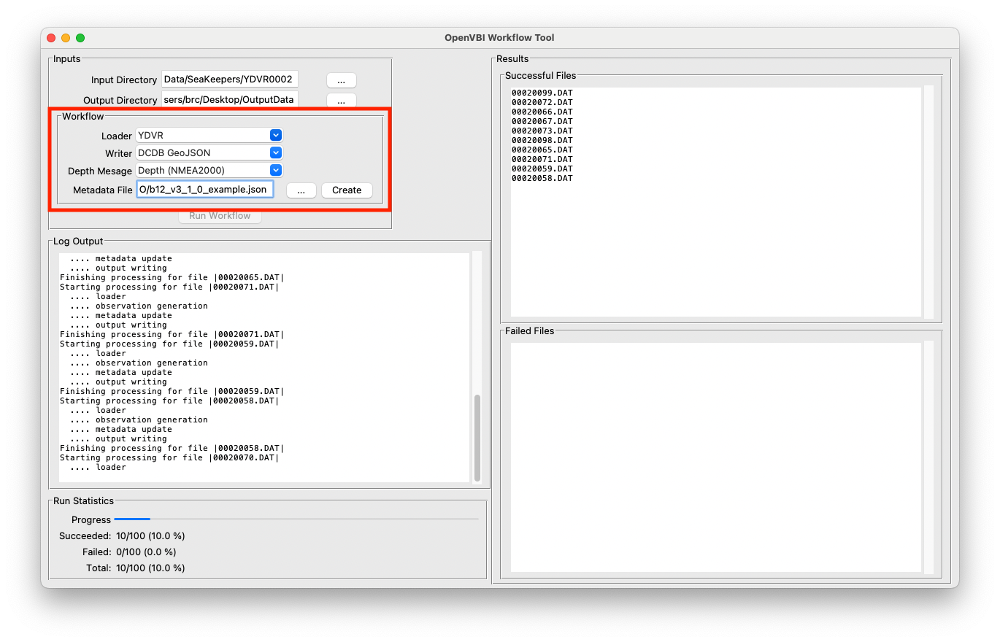
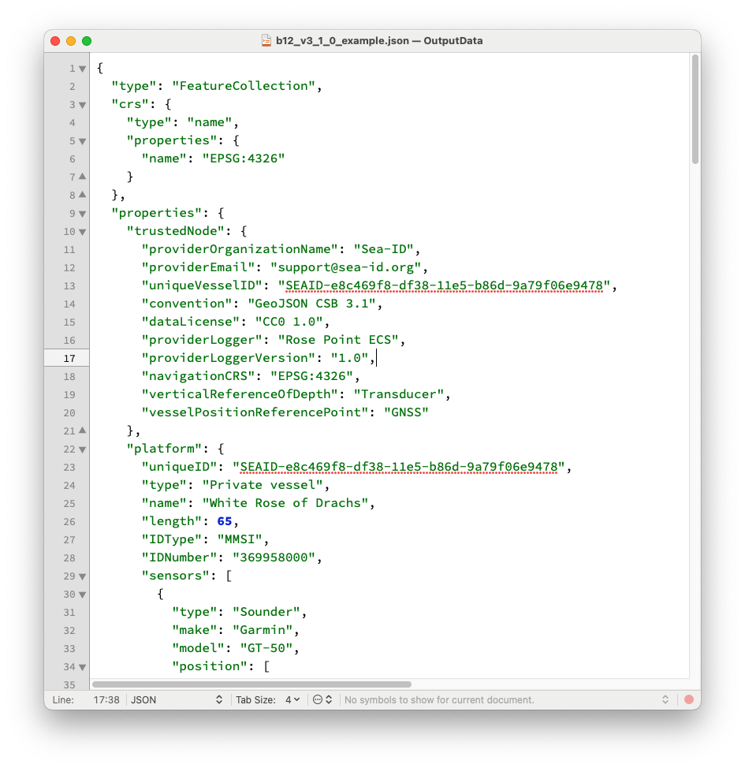
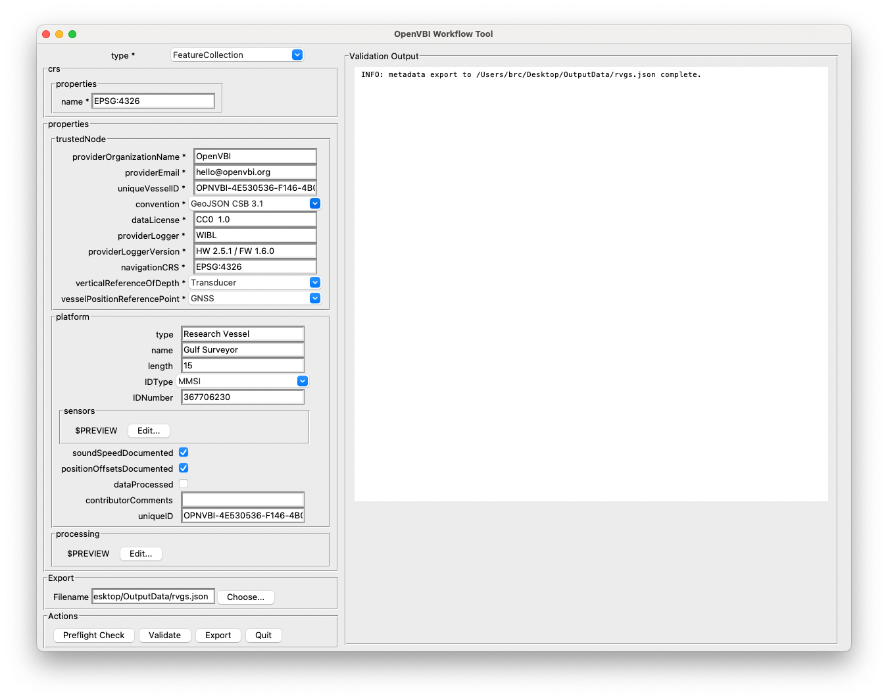
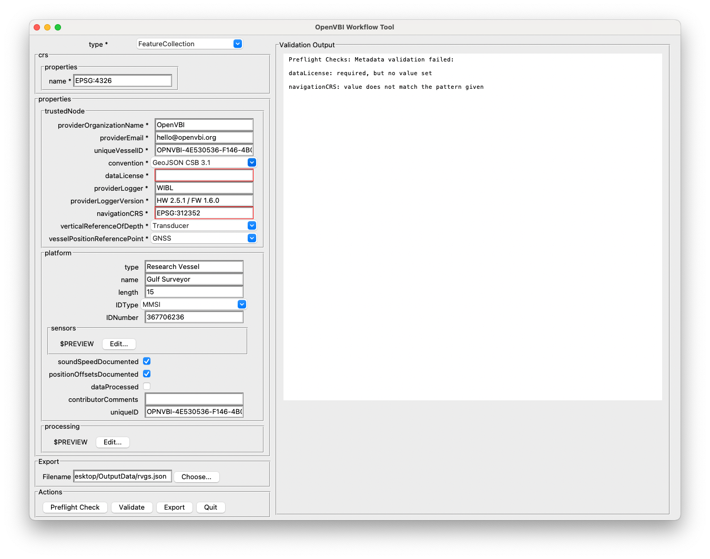
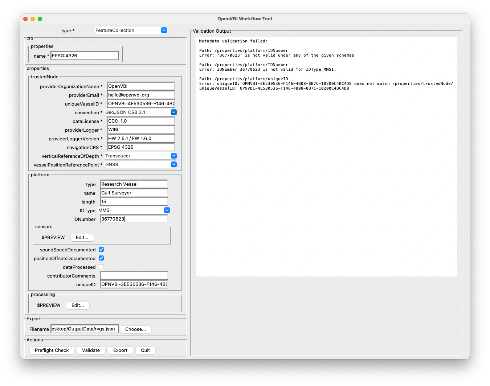

# Workflow GUI Tool

## Introduction

This folder contains, among the support functionality required, a GUI for running workflows in the ``OpenVBI`` framework.  A "workflow" in this context is a piece of Python code that defines the sequence of events that are used in processing a piece of VBI data, typically loading from a given format, applying metadata and appropriate filters, and writing into a format useful for further processing.  Workflows are defined as a protocol in [the init file](./__init__.py) as class ``Workflow``, and a basic workflow that loads, generates geo-referenced depths, manages metadata, and writes to a processed output format is defined as class ``BasicWorkflow`` in [the corresponding file](./basic_workflow.py).  Having the ``Workflow`` defined as a Python script means that it can be readily archived with the data, so that it's clear what the processing was: the script, and the release version of the ``OpenVBI`` library should adequately document the sequence of steps.

The ``Workflow`` interface allows it to be applied to a single file, but in many cases the problem is to process an entire folder of files that come from the same data collector (and therefore have the same core metadata).  This is mostly just a case of a small loop over all of the files, and can readily be done either as a shell script or a Python script.  However, on some platforms (particularly Windows) and for some users this is more complex than required or desired.  The GUI provided here implements the support functionality required to take a ``Workflow`` (specifically ``BasicWorkflow``) and apply it to all of the files (of particular format) in a folder, and write the outputs into a separate folder ready for archiving, or delivery to archives such as [DCDB](https://www.ncei.noaa.gov/iho-data-centre-digital-bathymetry).

Another common problem with loggers that don't manage their own metadata, or which have no concept of metadata, is to provide [IHO B.12 style metadata](https://github.com/CCOMJHC/CSBWG-B12) as is typically used for submission to the archive.  This is a JSON-formatted plain text file and can be created in any text editor, but getting the formatting right, and making sure that it meets the requirements (as defined by the [CSBSchema](https://github.com/CCOMJHC/csbschema) tool), can be problematic.  The GUI tool therefore also provides support for reading the digital description of the metadata schema (currently v 3.1.0) and automatically generating a GUI to allow the required and optional data to be provided to fabricate a metadata file from scratch, or to load and validate an existing metadata file.

The Workflow GUI tool is currently _experimental_ and may have limited or inconsistent functionality in places.  It has been tested, however, with YDVR (Yacht Devices) files, and [WIBL](https://github.com/CCOMJHC/WIBL) files, which appear to work well.  You can, and are encouraged to, use the [issue tracker](https://github.com/CCOMJHC/OpenVBI/issues) on the project repository to document bugs or suggested new features.

## Base Functionality

The Workflow GUI tool is a single window that's mostly monitoring output for the workflow; the primary inputs are to set the input and output directory (folder) for source and destination of files, and to customise the type of files to read, the type of files to write, the source of depth information to convert from the input files, and the metadata file to use, if required.

The only real control is the "Run Workflow" button, which triggers the use of a ``BasicWorkflow`` over all of the recognised files (using the suffix derived from the selected ``Loader`` drop-down menu item) in the input directory.

## Setting up a Workflow

The input section of the GUI provides for input/output directory (folder) specification, and automatically selects a setup for the workflow by default, using the most common selections.  In ``Workflow`` terms, a "Loader" is something that can read input data files and convert them into internal ``OpenVBI`` format (in practice, this is the set of file adapters listed in the [factory function](../adaptors/factory.py)).  Each loader has a default file suffix that it recognises as identifying a file that it can read (e.g., `.DAT` for Yacht Devices, `.wibl` for WIBL), which is used to pick files from the input directory as potential sources for processing.

A "Writer" specifies the output format; DCDB output in GEoJSON format is the default, but the CSV variant (i.e., a CSV file for data with JSON file for metadata) is also supported.  Due to the integral nature of the GeoJSON format (i.e., metadata and data together in one file so that the metadata can't be misplaced), this format should be strongly preferred unless there are strong arguments for the alternative.

Depending on the data source, the depth observations can be encoded differently.  For example, in NMEA2000 networks the depth is ususally specified in the "Depth" data message, but in NMEA0183 networks, it can be either "DBT" (Depth Below Transducer, without corrections for draft) or "DPT" (Depth, with corrections for draft).  The "Depth Message" drop-down allows for selection as appropriate to the data source.  Note that it is possible that no data will be converted (and the processing will fail) if you select a depth source that isn't in the input files.

Finally, for any data input file that does not contain metadata information required for the [IHO B.12 recommendations](https://github.com/CCOMJHC/CSBWG-B12) (which is pretty much all loggers except WIBL, currently), you should also specify an appropriately formatted JSON file with core metadata in the "Metadata File" input field.  See below for how to generate an appropriate file if you don't have one already.

Once the inputs are set up, the "Run Workflow" button starts the process: the "Input Directory" is scanned for all files with the recognition suffix for "Loader", applies the ``BasicWorkflow`` to each file in turn, and writes the output into "Output Directory".  Intermediate log outputs are provided per file and stage of processing in the "Log Output" pane, summary statistics (for files that process successfully and those that fail at any point) are provided at the bottom in the "Run Statistics" pane, and a list of successful and failed files are provided to the right, to allow remediation or investigation of failed files after the first run.

## Metadata Management and Validation

The [IHO B.12 recommendations](https://github.com/CCOMJHC/CSBWG-B12) specify a particular format for the metadata that is mandatory, recommended, and preferred, for VBI data being submitted to [DCDB](https://www.ncei.noaa.gov/iho-data-centre-digital-bathymetry) for archival.  Since 2025, the technical specification and management of the metadata requirements has been removed from the remit of the [IHO working group](https://iho.int/en/csbwg) on CSB in favour of DCDB, mostly to allow for more rapid evolution of the specification.  A schema for the JSON is available in digital form in the [CSBSchema](https://github.com/CCOMJHC/csbschema) repository, which also includes validation tools to ensure that metadata meets the requirements of the specification.

In principle, these metadata files are plain text files in JSON format,

 which can be created and formatted with any text editor.  In practice, however, the formatting can be a little complex, and making sure that data fields with requirements are filled in correctly can be problematic.  The metadata tool component in the Workflow GUI aims to assist with this by providing a GUI to specify the various components required, which is constructed automatically from the machine-readable schema for the metadata and indicates which fields are required, and which are optional but recommended.  This specification can then be written to a suitable output JSON file, and used for further processing.

 

In addition to creating metadata files, the tool can also be used to validate the existing specification.  A simple "preflight" check can be conducted using the entries available; any errors are reported to the right of the window, and the affected entries are highlighted in red.

However, there are semantic checks that the external validation tool uses to ensure that the metadata is valid which cannot be determined automatically from the schema.  Therefore, there is a secondary "Validate" option that causes the code to generate the output metadata file from the current entries, and then run the validation tool to provide full checks.  Any errors are reported to the right of the window, with the path in the metadata and reported error from the validation tool.

## Custom Workflows

The Workflow GUI hard-codes the use of the ``BasicWorkflow`` class to define the workflow, but to the extent that other workflows could be defined without further parameters, they could be readily integrated into the script either permanently (at ``MainWindow::on_run_workflow()``) or through a factory method that's driven by a drop-down menu.  A more flexible approach (e.g., loading a class from a specified Python file that defines a custom workflow) may also be possible in the future.

Custom workflows are defined as classes derived from the ``Workflow`` protocol [defined here](./__init__.py).  The requirements to meet the protocol are minimal:
1. The class must provide a string that can be used as a file suffix to identify files it can load from a target directory.
2. The class must provide a string that's used to generate the file suffix for output files (i.e., which can be used to replace the input suffix to make output names)
3. The class must provide a ``process_file()`` method that takes input and output directory paths, and, optionally, a callback function that can be used to announce the stages of the workflow starting and completing, if the ``Workflow``-derivative is correctly structured.  The callback is used, for example, in the GUI, to provide updated information to the user as the long-running process of working through the file goes through its different phases.

The ``process_file()`` method has no real restrictions, so long as it returns a tuple of a boolean success/failure indicator, and optionally a dictionary of errors that occurred during the processing of the file.  There is no required structure for the error dictionary, but a good basis is to have at least:
1. ``filename`` for the input file,
2. ``stage`` for a string indicating where the file failed processing, and
3. ``messages`` as a list of strings indicating what happened during the failed stage of processing.
